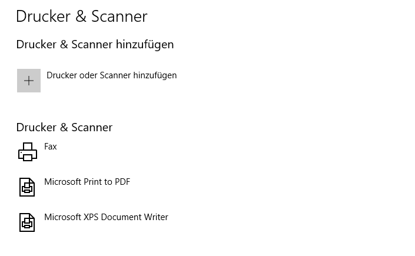

# Printer-Pi-DCP-115C


Cups network printserver with a Raspberry Pi 2/3, Brother DCP-115C and 433Mhz wireless sockets. With the following upgrade my old reliable printer has now basic network printer functionalities and is more environmentally friendly.

## Table of contents

* [Table of contents](#table-of-contents)
* [What does this documention provide?](#what-does-this-documention-provide)
* [Getting Started](#getting-started)
  * [Parts](#parts)
  * [Prerequisites](#prerequisites)
  * [Installation](#installation)
      * [Send module](#send-module)
      * [Printer status checks](#printer-status-checks)
      * [Tea4CUPS](#tea4cups)
      * [Cron](#cron)
* [Usage](#usage)
* [Contributing/Support](#contributingsupport)
* [License](#license)
* [Acknowledgments](#acknowledgments)

## What does this documention provide?

It is more a collection of sources which I have used to build this project than an exact fitting step by step manual. However, maybe this can help someone to setup their old printer too.

## Getting Started

You should have some basic experience in creating projects with a Raspberry Pi, Linux, GPIO wiring and the related stuff. I would **not** recommend to try this as your first project. The most difficult part was to get the Brother DCP-115C running on a Raspberry Pi because there are only x86 drivers from Brother available and it is not possible to generate ARM binaries.

### Parts

* **Raspberry Pi 2/3**
* **Printer**, if you don't want to struggle to setup a printer on your Pi [here](http://www.openprinting.org/printers) you can find out if your printer is supported by cups out of the box
* **433Mhz sender and receiver**, I used [this sensor package](https://www.amazon.de/Aukru-Superregeneration-Transmitter-Modul-receiver-module/dp/B00OLI93IC)
* **wireless socket and remote**, I bought this [set](https://www.amazon.de/gp/product/B001AX8QUM?ie=UTF8&linkCode=as2&camp=1634&creative=6738&tag=754-21&creativeASIN=B001AX8QUM) which is also used by several other tutorials
* **female-female jumper wires**, to connect the Pi with sender and receiver

### Prerequisites

* Raspberry Pi is running with an actual version of Raspbian Jessie, is connected to the internet and your local network.
* Cups is installed and running with your printer (means network printing is possible)
  * [Here](https://www.howtogeek.com/169679/how-to-add-a-printer-to-your-raspberry-pi-or-other-linux-computer/) is a good guide on how to setup cups and make a printer availabe in a local network
  * For my Brother printer I followed [this](https://www.lhinderberger.de/pi/2016/01/27/raspberry-pi-binary-x86-drivers.html) guide  which is unfortunately not available anymore. Instead [this](https://superuser.com/questions/781454/debian-arm-and-brother-dcp195c-with-cups) should be fine and maybe [this](https://www.raspberrypi.org/forums/viewtopic.php?f=28&t=127401) can help too. [Here](Brother_DCP-115C.ppd) is my ppd file
* Unpack and install [433Mhz_Utils](https://github.com/ninjablocks/433Utils/tree/master/RPi_utils) in your home directory, ensure that the 433Mhz module is working with it and find out your remote code, as described [here](https://www.princetronics.com/how-to-read-433-mhz-codes-w-raspberry-pi-433-mhz-receiver/)

### Installation

#### Send module

1. Copy [steuerung](/scripts/steuerung.cpp) (Template from: [Raspberry Pi Tutorials](https://tutorials-raspberrypi.de/raspberry-pi-funksteckdosen-433-mhz-steuern/)) into the /433Utils/RPI_utils in the home directory and insert your remote codes.

2. Compile it with:

``` bash
g++ -DRPI ../rc-switch/RCSwitch.cpp steuerung.cpp -o steuerung -lwiringPi
```

3. Try it out with:

``` bash
sudo ./steuerung 1
```

#### Printer status checks

Download [Printer_OFF_Check.py](/scripts/Printer_OFF_Check.py), [Printer_ON_Check.py](scripts/Printer_ON_Check.py)  and move them to a folder of your choice.

**Printer_ON_Check.py** sends "power on" if the printer is not found via usb = Power on. Usage:

```python
sudo python Printer_ON_Check.py
```

**Printer_OFF_Check.py** sends "power off" if the printer is on and no print jobs are active at the moment

```python
sudo python Printer_OFF_Check.py
```

#### Tea4CUPS

Is an open-source tool which allows you to define hooks before and after data was sent to cups. Instructions from [Gorsvet](https://gorsvet.de/komfortabel-drucken-mit-dem-raspberry-pi-und-cups/)

1. Download and unzip Tea4Cups

``` bash
wget http://www.pykota.com/software/tea4cups/download/tarballs/tea4cups-3.12_official.tar.gz
gunzip -c tea4cups-3.12_official.tar.gz | tar xvf -
```

2. Edit tea4cups.conf with an editor. Add the following line with the location of the script files to the prehook section and save the file. As result the ON script will be executed before cups starts to send data to the printer.

``` bash
prehook_POWERON : python /home/pi/Documents/Scripts/Printer/Printer_ON_Check.py
```

3. Move files to folders

``` bash
sudo mv tea4cups.conf /etc/cups
sudo mv tea4cups /usr/lib/cups/backend/
cd /usr/lib/cups/backend/
sudo chown root tea4cups
sudo chmod +x
```

4. Set up cups

``` bash
cd /etc/cups
sudo cp printers.conf printers.conf.O // backup old configuration
sudo nano /etc/cups/printers.conf
```

Change from

``` bash
DeviceURI usb://Brother/DCP-115C?serial=BROH6F900919
```

To

``` bash
DeviceURI tea4cups://usb://Brother/DCP-115C?serial=BROH6F900919
```

Restart cups

``` bash
sudo /etc/init.d/cups restart
```

#### Cron

Now everytime cups receives a new print job, it will automatically trigger the execution of the ON script. But we also want to turn off the printer after a certain time period if it is in an idle state.

Add a Cron job which triggers the execution of the OFF script

``` bash
crontab -e
#checks every 15 minutes if printer is on/still working
*/15 * * * * sudo python /home/pi/Documents/Scripts/Printer/Printer_OFF_Check.py
```

Now everything is ready to start printing.

## Usage

**Linux/Ubuntu:**
Depending on the cups settings, I experienced that Ubuntu worked out of the box with "ipps"

**Windows:**
Maybe you have to download additional drivers with windows update


## Contributing/Support

If you have any additions or problems regarding this guide, just open an issue or send me a pm.

## License

This project is licensed under the MIT License - see the [LICENSE](LICENSE) file for details.

## Acknowledgments

* [Raspberry Pi Tutorials](https://tutorials-raspberrypi.de/raspberry-pi-funksteckdosen-433-mhz-steuern/)
* [Elektronik Kompendium](https://www.elektronik-kompendium.de/sites/raspberry-pi/2007081.htm)
* [Gorsvet](https://gorsvet.de/komfortabel-drucken-mit-dem-raspberry-pi-und-cups/)
